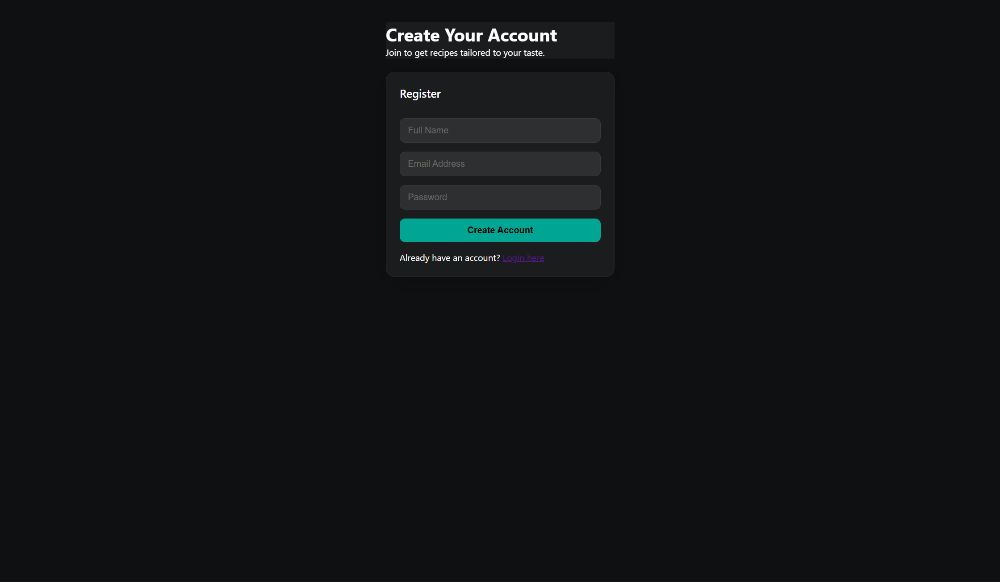
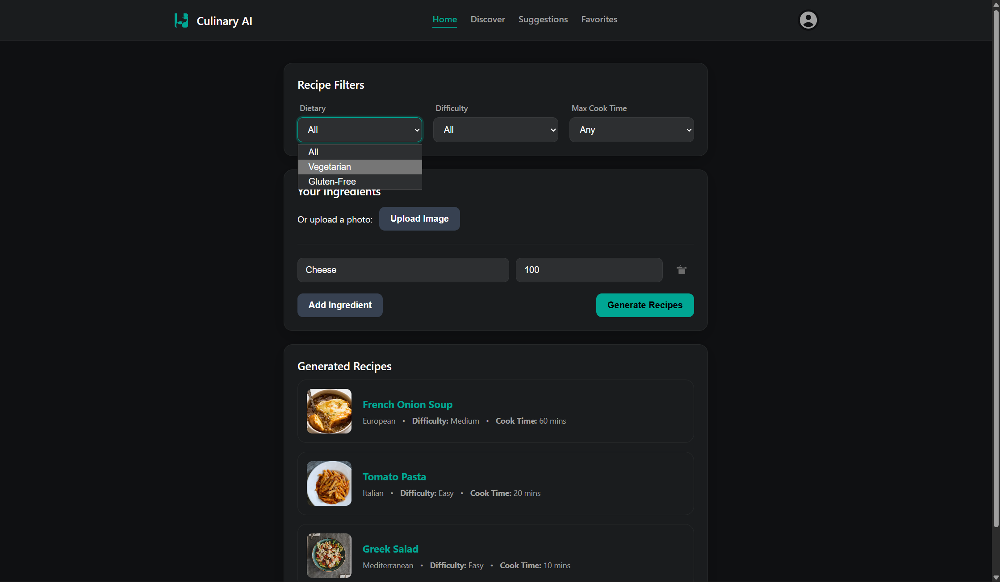
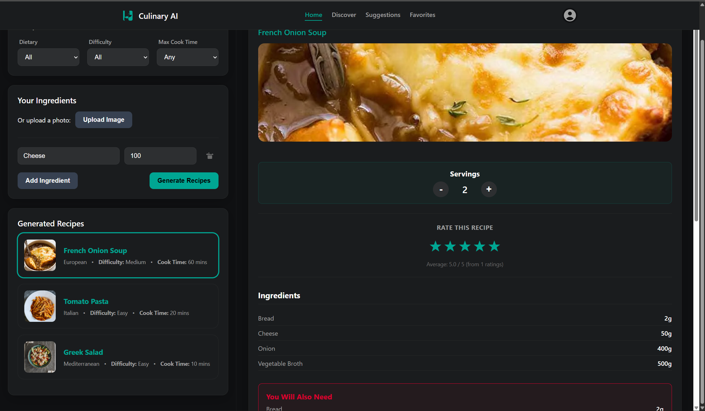
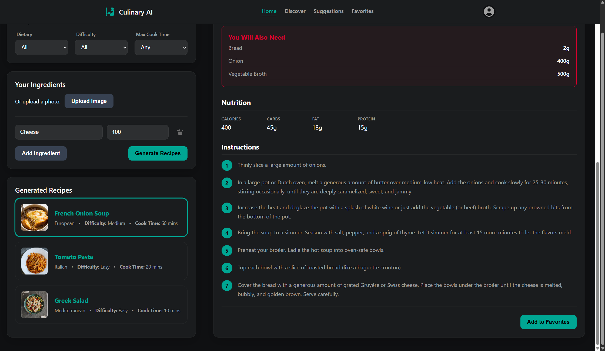

# Culinary AI - Smart Recipe Generator

**Live Application URL:** [https://smart-recipe-generator-1-yf6b.onrender.com/](https://smart-recipe-generator-1-yf6b.onrender.com/)
**Author:** Abhay

---

## Table of Contents

* [Brief Write-Up](#brief-write-up)
* [Tech Stack](#tech-stack)
* [Features Implemented](#features-implemented)
* [Folder Structure](#folder-structure)
* [Technical Architecture](#technical-architecture)
* [AI and Algorithm Logic](#ai-and-algorithm-logic)
* [Error Handling & UX](#error-handling--ux)

---

## Brief Write-Up

Culinary AI is a full-stack web application designed generate recipes transforming user-provided ingredients into delicious recipe suggestions. The core of the application is a Flask backend that manages user authentication, a recipe database, and a custom recipe-matching algorithm. This algorithm scores recipes based on the ingredients a user has, incorporating a substitution map to maximize options. A key feature is the integration with the Clarifai API, allowing users to upload a photo of their ingredients for automatic recognition. The frontend is built with vanilla HTML, CSS, and JavaScript, featuring a responsive interface for a seamless user experience. The application is deployed on Render, utilizing a Gunicorn web server for production.

---

## Tech Stack

| Category       | Technology                                 |
| -------------- | ------------------------------------------ |
| Frontend       | HTML5, CSS3, JavaScript (ES6)              |
| Backend        | Python, Flask, Gunicorn                    |
| Database       | SQLite, SQLAlchemy (ORM)                   |
| Authentication | PyJWT (JSON Web Tokens)                    |
| AI / ML        | Clarifai API (Food Item Recognition Model) |
| Deployment     | Render, Git, GitHub                        |

---

## Features Implemented

* **User Authentication:** Secure registration and login using JWT for stateless session management.
* **Ingredient Input:** Manual text input with autocomplete suggestions.
* **AI-Powered Image Recognition:** Users can upload a photo of their ingredients for automatic recognition via the Clarifai API.
* **Recipe Matching Algorithm:** A custom scoring logic that ranks recipes based on available ingredients.
* **Substitution Suggestions:** Intelligently suggests recipes even if a user is missing an ingredient by checking a substitution map.
* **Advanced Filtering:** Users can filter generated recipes by dietary restrictions (Vegetarian, Gluten-Free), difficulty, and maximum cooking time.
* **Dynamic Serving Size Adjustment:** The recipe detail view allows users to dynamically increase or decrease the serving size, which updates all ingredient quantities in real-time.
* **User Feedback and Suggestions:**

  * Users can rate recipes using a 5-star system.
  * A suggestion engine provides personalized recipe recommendations based on a collaborative filtering algorithm.
* **Favorite Recipes:** Authenticated users can save and view their favorite recipes.
* **Recipe Database:** An in-memory database of over 30 recipes with detailed steps, images, and nutritional info.
* **Deployment:** The application is deployed on Render for public access.

---

## Folder Structure

```plaintext
RECIPE/
├── app/
│   ├── __init__.py         # App factory, blueprint registration
│   ├── auth.py             # Authentication routes (login, register)
│   ├── extensions.py       # Flask extension instances (Bcrypt)
│   ├── models.py           # SQLAlchemy models and in-memory data
│   ├── recipes.py          # Core API routes for recipes, AI, etc.
│   └── utils.py            # Utility functions (e.g., token decorator)
│
├── static/
│   ├── app.js              # JS for the main application
│   ├── auth.js             # JS for login/register pages
│   ├── landing.css         # Styles for the landing page
│   └── style.css           # Global styles for the entire app
│
├── templates/
│   ├── index.html          # Main application page (master-detail view)
│   ├── landing.html        # Public landing page
│   ├── login.html          # Login page
│   └── register.html       # Registration page
│
├── .gitignore              # Files to be ignored by Git
├── database.db             # SQLite database file
├── README.md               # Project documentation
├── requirements.txt        # Python dependencies
└── run.py                  # Entry point to run the Flask app
```

---

## Technical Architecture

The application follows a classic client-server architecture, deployed on Render.

### System Architecture Diagram

```mermaid
graph TD
    A[User Browser: HTML/CSS/JS] --> B[Gunicorn Server]
    B --> C[Flask App]
    C --> D[(SQLite DB)]
    C --> E[(In-Memory Store)]
    C --> F[Clarifai API]
```

### File Interaction Diagram

```mermaid
graph LR
    %% Browser
    A[index.html] --> B[app.js]
    B --> C[/api/generate]

    %% Backend
    D[run.py] --> E[app/__init__.py]
    E --> F[app/recipes.py]
    C --> F
    F --> G[app/utils.py]
    F --> H[app/models.py]
    H --> I[(database.db)]

```

---

## AI and Algorithm Logic

The application's intelligence is driven by three key components: image recognition, recipe matching, and recipe suggestions.

### 1. Ingredient Recognition (Clarifai API)

* **Service:** Clarifai 'food-item-recognition' model.
* **Process:**

  1. Frontend sends the uploaded image file to the Flask backend.
  2. Backend forwards these bytes to the Clarifai API.
  3. API returns a list of concepts (ingredients) with confidence scores.
  4. Filtering: only concepts with confidence > 0.4 are considered and cross-referenced with the internal ingredient list.

### 2. Recipe Matching Algorithm (Heuristic Scoring)

* **Scoring Logic:**

  ```
  Score = (Perfect Matches + (Substitution Matches * 0.7)) / Total Ingredients
  ```
* **Breakdown:**

  * Perfect Matches (Weight: 1.0): Ingredient the user has.
  * Substitution Matches (Weight: 0.7): Valid substitute the user has (from SUBSTITUTION_MAP).
  * Normalization: Divide by total ingredient count to prevent bias towards shorter recipes.

### 3. Recipe Suggestion Algorithm (Collaborative Filtering)

* **Process:**

  1. Find recipes the current user has rated 3+ stars.
  2. Identify "similar users" with overlapping high ratings.
  3. Recommend other recipes these similar users liked that the current user hasn’t tried.
* **Fallback:** If no similar users are found, suggest top 5 highest-rated recipes.

---

## Error Handling & UX

* **Loading States:** All async actions trigger spinners.
* **Toast Notifications:** Non-intrusive success/error messages.
* **Frontend Errors:** `try...catch` around all `fetch` calls.
* **Backend Errors:** Proper HTTP status codes (400, 401, 404, 409) for different error conditions.

---

## Getting Started Locally

### Prerequisites

* Python 3.9+
* Virtual environment (`venv`)
* Git

### Installation

```bash
git clone https://github.com/n3utr7no/smart-recipe-generator.git
cd smart-recipe-generator
python -m venv venv
.\venv\Scripts\activate   # Windows
# source venv/bin/activate # macOS/Linux
pip install -r requirements.txt
flask run
```

Access frontend by opening `frontend/index.html` in a browser.

---

## Deployment

* **Service Type:** Web Service
* **Build Command:** `pip install -r requirements.txt`
* **Start Command:** `gunicorn run:app`
* **Environment Variable:** `PYTHON_VERSION=3.11.9`

---

## Future Extensions and Scaling

* Enhanced collaborative filtering for personalized suggestions
* User-submitted recipes and admin moderation
* Database migration from in-memory to PostgreSQL
* Redis caching for popular recipes
* Integration with external nutritional APIs

---

## Screenshots

**Landing Page**


**Registration Page**


**Main Interface**


**Recipe Detail View**



---
